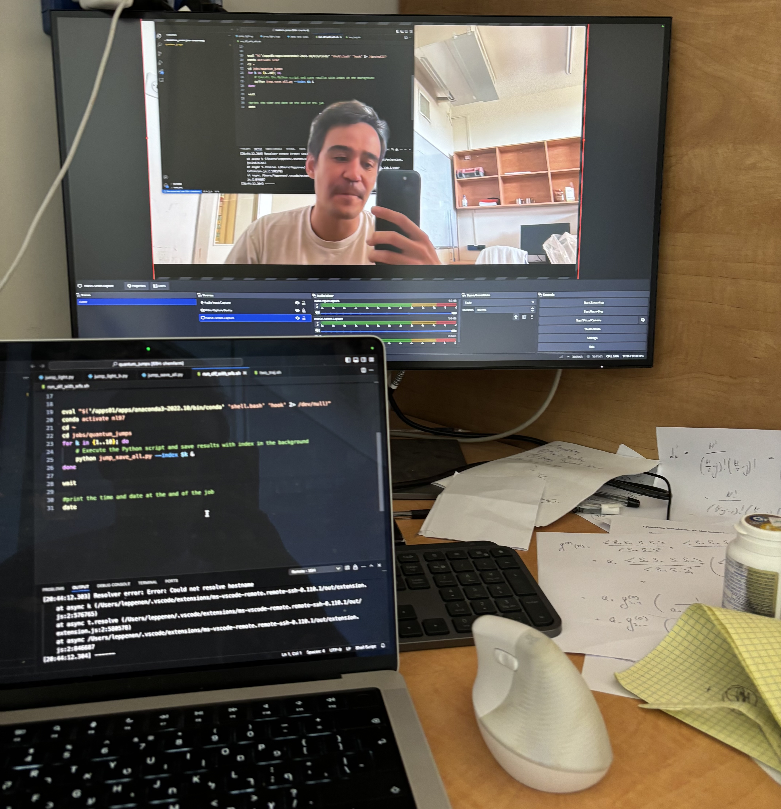
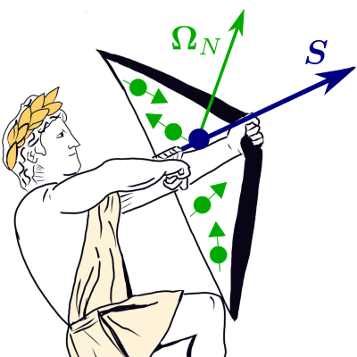
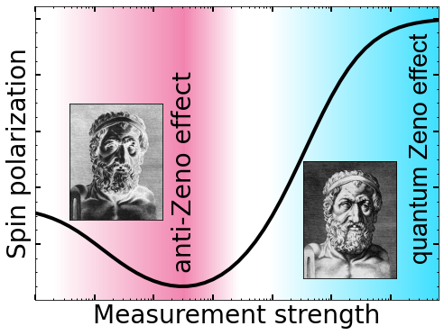
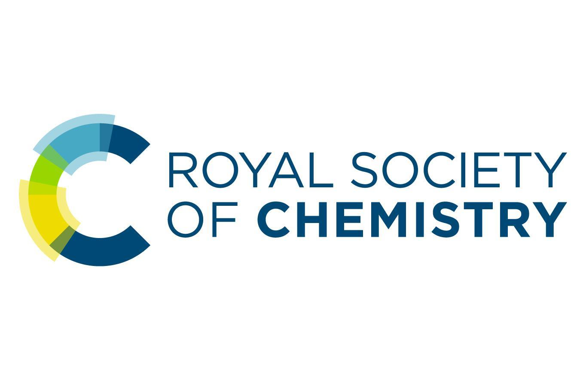

# Nikita Leppenen

_Last updated: {{ site.time | date: "%B %d, %Y" }}_

I am a theoretical physicist doing PhD in the field of quantum optics at the Weizmann Institute of Science, Rehovot, Israel 🇮🇱. I have a solid background in solid-state physics and a quantized knowledge of quantum computing. 
Welcome to my page! 

  

## Short bio

Hometown: [Petrozavodsk, Republic of Karelia, Russia](https://www.google.com/maps/place/Petrozavodsk,+Republic+of+Karelia,+Russia/@61.8417108,34.2363804,11z/data=!4m6!3m5!1s0x46a1ec3dd7bf1fe7:0xe49db0d89a0485d4!8m2!3d61.7781617!4d34.3640395!16zL20vMDFzaG5t?hl=en&entry=ttu&g_ep=EgoyMDI1MDMxOC4wIKXMDSoASAFQAw%3D%3D) 

If you want to get an idea of the landscape, I would recommend [this video](https://www.youtube.com/watch?v=FhqalqZeEGg). It goes with the popular song about Karelia, translated into the *karjalan kieli*, which is the local Finnish dialect I don't speak at all, as well as Finnish language in general. 

Now: [Rehovot, Israel](https://www.google.com/maps/place/Rehovot/)

### Education
- **Ph. D**: Weizmann Institute of Science (2022 - Current)
- **M.S.**: ITMO University (2019 - 2021)
- **B.S.**: Saint Petersburg Academic University (2015 - 2019)
- **School Education:** Lyceum No. 13, Petrozavodsk (2004 - 2015)

### Scientific Groups 
- [Sector of Theory of Quantum Coherent Phenomena in Solids](https://www.ioffe.ru/coherent/), Ioffe Institue, 2017 - 2022
- [Collective Quantum Optics](https://www.weizmann.ac.il/chembiophys/shahmoon/home), Weizmann Institute of Science, since 2022

## Research Highlights 

### 🔬 Current

- **Superradiance**
  
  *with Dr. Ephraim Shahmoon*

### 📜 Past 

- **Photogalvanics in topological insulators and semimetals (Bachelor Thesis + PhD beginning)**

  *with Prof. Leonid Golub*

- **Quantum Zeno effect in Quantum Dots**

  *with Dr. Dmitry S. Smirnov*

  The research aimed to study the quantum backaction during measurement of the electron spin in quantum dots. I can divide this study to two areas that intersect between themselves.
  
    
    
    

      
      
    

    
    

      <strong>Figure Zeno.</strong> <strong>Left panel:</strong> Sketch of the system — an electron spin (dark blue arrow) localized in a quantum dot, interacting with a random magnetic field (large green arrow) produced by nuclear spins (small green arrows with dots). Due to the quantum Zeno effect (abstractly represented by Eros, but generally arising from continuous or pulsed pump–probe measurements of the electron spin), the electron’s spin precession is suppressed. This figure is a popular illustration from paper [Z2]. <strong>Right panel:</strong> Depending on the ratio between the probe power and the average amplitude of the random field, the spin relaxation can either be accelerated due to interaction with nuclei (anti-Zeno effect) or suppressed (Zeno effect). This figure is a popular illustration from paper [Z3].
    

  
  #### References

  
[Z1] 
    Leppenen, Lanco, Smirnov,
    <a href="https://doi.org/10.1103/PhysRevB.103.045413">
      <strong>Phys. Rev. B</strong> 103, 045413 (2021)
    </a>
  

  
[Z2] 
    Leppenen & Smirnov,
    <a href="https://doi.org/10.1039/D2NR01241C">
      <strong>Nanoscale</strong> 14, 13284 (2022)
    </a>
  

  
[Z3] 
    Nedelea, Leppenen, Evers, Smirnov, Bayer, Greilich,
    <a href="https://doi.org/10.1103/PhysRevResearch.5.L032032">
      <strong>Phys. Rev. Research</strong> 5, L032032 (2023)
    </a>
  

  
[Z4] 
    Leppenen & Smirnov,
    <a href="https://doi.org/10.1002/qute.202400193">
      <strong>Adv. Quantum Technol.</strong> (2024)
    </a>
  

  
[Z5] 
    Serov, Galimov, Smirnov, Rakhlin, Leppenen, <em>et&nbsp;al.</em>,
    <a href="https://doi.org/10.1103/PhysRevApplied.23.044019">
      <strong>Phys. Rev. Applied</strong> 23, 044019 (2025)
    </a>
  

- **Optical absorption in TMDC (Master Thesis)**

  *with Prof. Leonid E. Golub  and Prof. Eugeniuys L. Ivchenko*
  
  We studied the influence of the nonparabolic spectrum on the exciton oscillator strength and Sommerfeld factor todo: add code

  
[TMDC 1] 
    Leppenen, Golub & Ivchenko,
    <a href="https://doi.org/10.1103/PhysRevB.102.155305">
      <strong>Phys. Rev. B</strong> 102, 155305 (2020)
    </a>
  

  
[TMDC 2] 
    Leppenen, Golub & Ivchenko,
    <a href="https://doi.org/10.1103/PhysRevB.103.235311">
      <strong>Phys. Rev. B</strong> 103, 235311 (2021)
    </a>
  

## Contact

- GitHub: [leppenen](https://github.com/leppenen)
- Google Scholar: [Nikita Leppenen](https://scholar.google.com/citations?user=idd_-k8AAAAJ&hl=en)
- Email: nikita.leppenen_at_weizmann.ac.il
