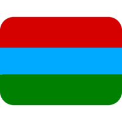
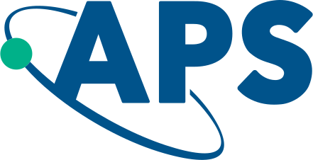

# Nikita Leppenen

_Last updated: {{ site.time | date: "%B %d, %Y" }}_

I am a theoretical physicist doing PhD in the field of quantum optics at the Weizmann Institute of Science, Rehovot, Israel 🇮🇱. I have a solid background in solid-state physics and a quantized knowledge of quantum computing. 
Welcome to my page! 

  

## Short bio

Hometown: [Petrozavodsk, Republic of Karelia, Russia](https://www.google.com/maps/place/Petrozavodsk,+Republic+of+Karelia,+Russia/@61.8417108,34.2363804,11z/data=!4m6!3m5!1s0x46a1ec3dd7bf1fe7:0xe49db0d89a0485d4!8m2!3d61.7781617!4d34.3640395!16zL20vMDFzaG5t?hl=en&entry=ttu&g_ep=EgoyMDI1MDMxOC4wIKXMDSoASAFQAw%3D%3D) 

If you want to get an idea of the landscape, I would recommend [this video](https://www.youtube.com/watch?v=FhqalqZeEGg). It goes with the popular song about Karelia, translated into the *karjalan kieli*, which is the local Finnish dialect I don't speak at all, as well as Finnish language in general. 

Now: [Rehovot, Israel](https://www.google.com/maps/place/Rehovot/)

### Education
- **Ph. D**: Weizmann Institute of Science (2022 - Current)
- **M.S.**: ITMO University (2019 - 2021)
- **B.S.**: Saint Petersburg Academic University (2015 - 2019)
- **School Education:** Lyceum No. 13, Petrozavodsk (2004 - 2015)

### Scientific Groups 
- [Sector of Theory of Quantum Coherent Phenomena in Solids](https://www.ioffe.ru/coherent/), Ioffe Institue, 2017 - 2022
- [Collective Quantum Optics](https://www.weizmann.ac.il/chembiophys/shahmoon/home), Weizmann Institute of Science, since 2022

## Research Highlights 

### 🔬 Current

- **Superradiance**
  
  *with Dr. Ephraim Shahmoon*

### 📜 Past 

- **Photogalvanics in topological insulators and semimetals (Bachelor Thesis + PhD beginning)**

  *with Prof. Leonid Golub*

- **Quantum Zeno effect in Quantum Dots**

  *with Dr. Dmitry S. Smirnov*

  The research aimed to study the quantum backaction while measuring the electron spin in quantum dots. I can devide this study to two areas that intersect between themselves.

  #### References

Z1.   
   N. Leppenen, D. S. Smirnov, *Quantum Zeno effect and quantum nondemolition spin measurement in a quantum dot–micropillar cavity in the strong coupling regime*, **Phys. Rev. B** 103, 045413 (2021). DOI: [10.1103/PhysRevB.103.045413](https://doi.org/10.1103/PhysRevB.103.045413)

Z2.   
   N. Leppenen, D. S. Smirnov, *Optical measurement of electron spins in quantum dots: quantum Zeno effects*, **Nanoscale** 14, 13284 (2022). DOI: [10.1039/D2NR01241C](https://doi.org/10.1039/D2NR01241C)

Z3.   
   D. Nedelea *et al.*, *Tuning the nuclei-induced spin relaxation of localized electrons by the quantum Zeno and anti-Zeno effects*, **Phys. Rev. Research** 5, L032032 (2023). DOI: [10.1103/PhysRevResearch.5.L032032](https://doi.org/10.1103/PhysRevResearch.5.L032032)

Z4.   
   N. Leppenen, D. S. Smirnov, *Birefringent Spin-Photon Interface Generates Polarization Entanglement*, **Adv. Quantum Technol.** (First published: 26 Aug 2024). DOI: [10.1002/qute.202400193](https://doi.org/10.1002/qute.202400193)

Z5.   
   A. Serov *et al.*, *Hidden anisotropy controls spin-photon entanglement in a charged quantum dot*, **Phys. Rev. Applied** 23, 044019 (2025). DOI: [10.1103/PhysRevApplied.23.044019](https://doi.org/10.1103/PhysRevApplied.23.044019)

- **Optical absorption in TMDC (Master Thesis)**

  *with Prof. Leonid E. Golub  and Prof. Eugeniuys L. Ivchenko*
  
  We studied the influence of the nonparabolic spectrum on the exciton oscillator strength and Sommerfeld factor todo: add code

  [Exciton oscillator strength paper](https://doi.org/10.1103/PhysRevB.102.155305) [Sommerfeld factor paper](https://doi.org/10.1103/PhysRevB.103.235311)

## Contact

- GitHub: [leppenen](https://github.com/leppenen)
- Google Scholar: [Nikita Leppenen](https://scholar.google.com/citations?user=idd_-k8AAAAJ&hl=en)
- Email: nikita.leppenen_at_weizmann.ac.il
